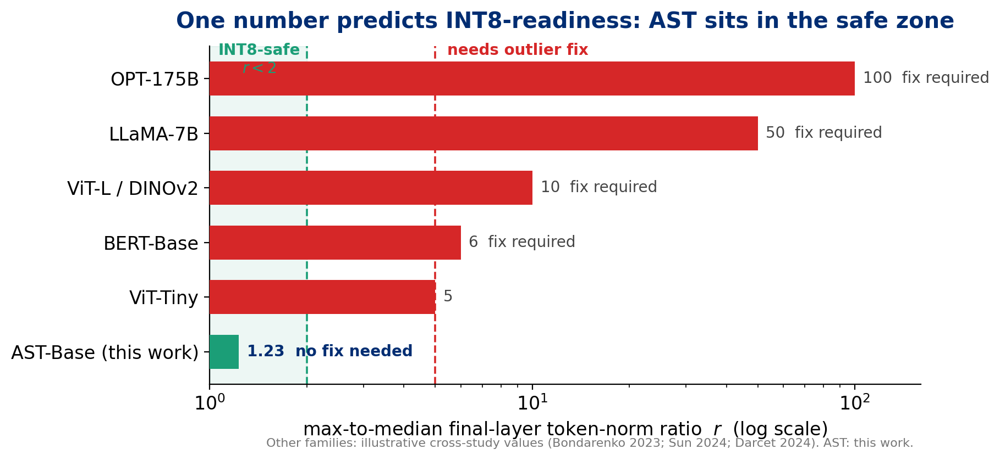
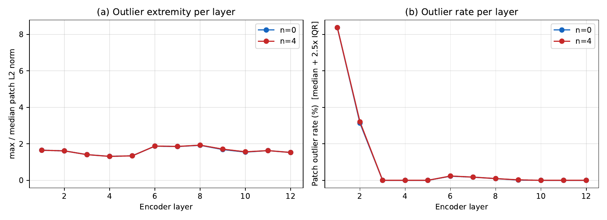
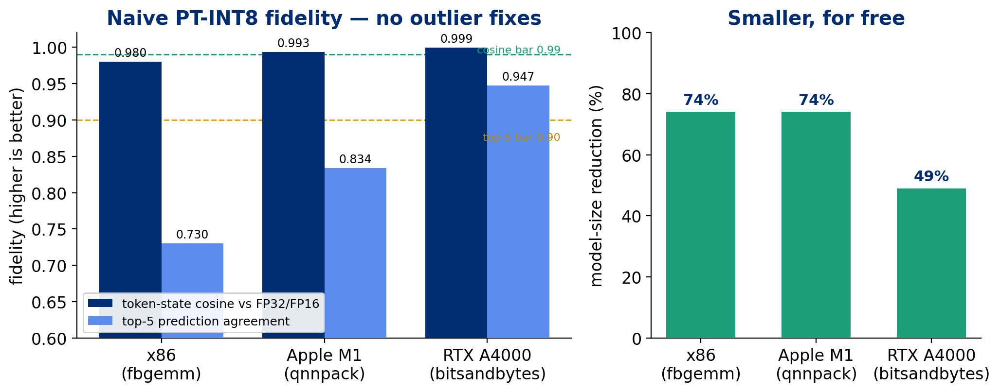
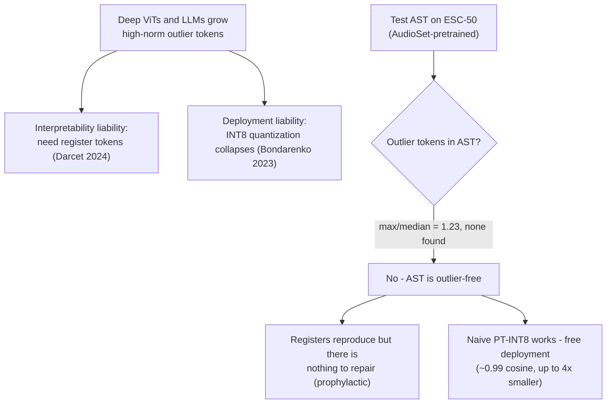

<p align="center">
  <picture>
    <source media="(prefers-color-scheme: dark)" srcset="assets/jhu-logo-white.png">
    
  </picture>
</p>

<h1 align="center">Silence in the Noise</h1>

<p align="center"><b>Probing Attention Artifacts and Register Tokens in Audio Spectrogram Transformers</b></p>

<p align="center"><b>Suleman Imdad</b> — M.S. in Artificial Intelligence, Johns Hopkins University (2026)</p>

<p align="center">
  <a href="LICENSE"></a>
  
  
  
  
  <a href="Imdad_Final_Research_Paper.pdf"></a>
</p>

<p align="center"><sub>Completed as coursework for <b>JHU EN.705.744 — Deep Learning Using Transformers</b>. A personal student project; <b>not</b> an official Johns Hopkins University publication or endorsed by the University.</sub></p>

Companion code, data artifacts, and figures for the paper. The full empirical
pipeline reproduces from a clean environment in a few hours and ~\$1 of commodity
cloud compute.

## Key results at a glance

**The whole paper in one number.** A transformer's max-to-median final-layer
token-norm ratio $r$ predicts whether post-training INT8 quantization will survive.
AST sits at **1.23** — deep in the safe zone — while the ViT/BERT/LLM families it is
architecturally near-identical to sit far past the fix-required threshold.

<p align="center"></p>

**AST is outlier-free at every layer** — no late-layer phase transition, unlike deep ViTs.

<p align="center"></p>

**So naive PT-INT8 just works** — 0.98–0.999 token-state fidelity and 49–74% smaller, on three backends, with zero outlier mitigations.

<p align="center"></p>

### How the argument fits together



<details>
<summary><b>The three findings, in words</b></summary>

1. **AST is outlier-free.** The public AudioSet-pretrained AST has a tight,
   unimodal patch-token norm distribution (final-layer max/median = 1.23, ratio
   ≤ 1.93 at every layer) — it does **not** develop the Darcet-style high-norm
   "register" artifact documented in deep ViTs.
2. **Register tokens reproduce mechanically** (absorb ~8.5× chance attention) but
   give only a small, non-significant fine-tuning stability trend on ESC-50
   (σ 1.04 → 0.73 pp; +0.33 pp mean; p ≈ 0.12–0.15) — there is no pathology to fix.
3. **AST is INT8 deployment-friendly.** Naive post-training INT8 quantization
   reaches 0.98–0.999 token-state cosine fidelity and 49–74% size reduction on
   x86 / Apple-Silicon / CUDA with no architectural fixes (the strict cosine+top-5
   bar is met cleanly on the CUDA path).
</details>

## Venue-customized versions

`submissions/` holds standalone, submission-ready condensations of this paper for
four venues (ICASSP, DCASE Workshop, Interspeech — anonymized, and a NeurIPS-style
ML workshop), each with its own template and figures. See
[`submissions/README.md`](submissions/README.md). The full-length / arXiv version
is `Imdad_Final_Research_Paper.{tex,pdf}` in the repo root.

## Repository layout

```
Imdad_Final_Research_Paper.tex / .pdf   The paper
Imdad_Final_Research_Paper.ipynb        Companion notebook (Restart & Run All)
measure_real_results.py                 Diagnostic sweep n ∈ {0,2,4,8,16}
train_full_5fold.py                     ESC-50 5-fold CV, 2 seeds (vast.ai)
layer_wise_norms.py                     Per-layer max/median + outlier-rate sweep
quantization_test.py                    INT8 fidelity, x86 (fbgemm) / ARM (qnnpack)
cuda_quantization_test.py               INT8 fidelity, CUDA (bitsandbytes)
analyze_5fold.py                        Bootstrap CIs, paired/permutation tests, F-test
spectrogram_attention.py                Attention-map figure
generate_deployment_diagram.py          Deployment pipeline figure
render_cuda_quant_fig.py                CUDA quantization figure
generate_readme_figures.py              README hero charts (from real data) -> assets/
vast_run.sh / gcp_run.sh / GCP_RUNBOOK.md   Cloud spot-rental run scripts
paper_assets/                           All figures (fig_*.pdf) + result JSON/NPZ
submissions/                            Venue-customized submission-ready papers
assets/                                 README figures + JHU logo
```

## Setup

```bash
python -m venv .venv && source .venv/bin/activate
pip install -r requirements.txt
```

`bitsandbytes` (CUDA INT8) is Linux/GPU-only; the x86 and ARM INT8 paths use
PyTorch's native dynamic quantization and need no extra package.

## Reproducing the results

| Script | Paper section | Output |
| --- | --- | --- |
| `measure_real_results.py` | Diagnostics (Table I, Figs. 3–5) | `paper_assets/real_results.json`, norm/attention NPZ |
| `layer_wise_norms.py` | Layer-wise analysis (Fig. 1) | `paper_assets/layer_wise_norms.json` |
| `train_full_5fold.py` | Fine-tuning (Table II, Fig. 6) | `paper_assets/real_5fold_*.json/.npz` |
| `analyze_5fold.py` | Stats + per-class (Fig. 7) | `paper_assets/real_5fold_summary.json` |
| `quantization_test.py` | INT8 CPU (Table III) | `paper_assets/quantization_results.json` |
| `cuda_quantization_test.py` | INT8 CUDA (Table III, Fig. 8) | `paper_assets/cuda_quantization_results.json` |

The committed `paper_assets/*.json` and `*.npz` are the exact measurements used
in the paper, so figures regenerate without re-running the GPU experiments.

## Data and model

- **Dataset:** [ESC-50](https://github.com/karolpiczak/ESC-50) (2,000 clips, 50
  classes), downloaded from the canonical GitHub release.
- **Checkpoint:** `MIT/ast-finetuned-audioset-10-10-0.4593` (HuggingFace Hub).
- **Seeds:** fixed at 42 and 43 throughout.

INT8 conversion of the AST checkpoint is a single line:
```python
torch.quantization.quantize_dynamic(model, {torch.nn.Linear}, dtype=torch.qint8)
```

## Compute cost

Diagnostics run in <5 min on a laptop. The dual-seed 5-fold training was ~7 h on
two RTX A4000 spot instances (~\$0.70 on vast.ai). INT8 evaluation added ~\$0.07
of spot rentals. Total: ~\$1.

## Citation

```bibtex
@misc{imdad2026silence,
  title  = {Silence in the Noise: Probing Attention Artifacts and Register
            Tokens in Audio Spectrogram Transformers},
  author = {Suleman Imdad},
  year   = {2026},
  note   = {Johns Hopkins University, EN.705.744 Deep Learning Using Transformers}
}
```

## License

Code is released under the [MIT License](LICENSE). The ESC-50 dataset and the AST
checkpoint are governed by their respective upstream licenses.

The Johns Hopkins University logo (`assets/jhu-logo-*`, the University's official
primary logo) is a **trademark** of Johns Hopkins University, reproduced from the
official brand assets. It is used here solely for coursework attribution, does
**not** imply University endorsement, and is **not** covered by the MIT License
above. Official brand assets and usage guidelines: <https://brand.jhu.edu>.
